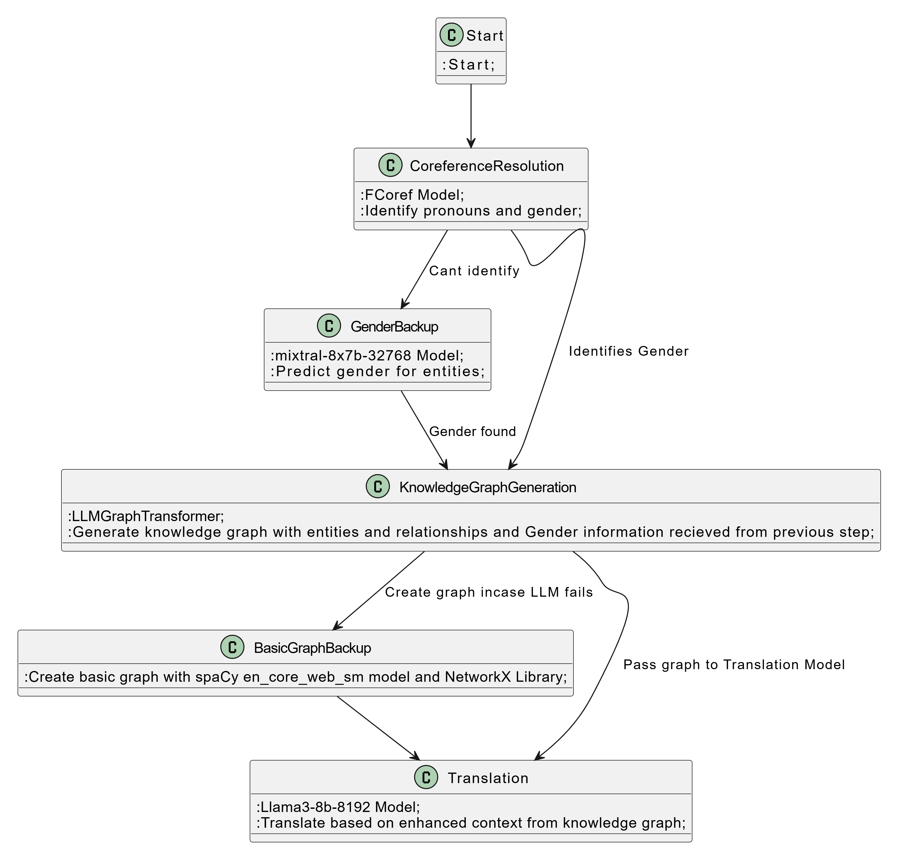

# Arthantar

## Contextual Translation Integrating Coreference Analysis, Large Language Models, and Knowledge Graphs

Arthantar is a sophisticated multi-layered system designed to enhance translation accuracy by integrating gender identification, coreference resolution, and knowledge graph (KG) generation. This approach ensures accurate and contextually relevant translations by leveraging cutting-edge technologies and fallback mechanisms.

### Key Features

1. **Gender Identification**
   - Utilizes the **FCoref module** for identifying gendered pronouns and assigning genders to entities based on context.
   - Employs predefined sets of male and female pronouns to infer gender through analysis of related pronoun clusters.
   - Integrates the **mixtral-8x7b-32768 model** via the Groq API as a backup, predicting gender based on contextual clues like entity names and roles.

2. **Coreference Resolution**
   - Resolves ambiguous pronouns and determines entity genders accurately.
   - Analyzes clusters of related pronouns and assigns genders by leveraging a carefully tested coreference model.
   - Ensures precision with proper noun gender inference, focusing on entity context.

3. **Knowledge Graph Generation**
   - Leverages the **LLMGraphTransformer library** to create knowledge graphs encapsulating entities, relationships, and gender data.
   - Converts input text into graph documents enriched with context, nodes, and relationships.
   - Ensures integration of coreference and LLM-derived gender information into the KG for enhanced translation context.

4. **Multi-Level Fallback System**
   - Employs a robust fallback hierarchy to maintain functionality in case of model failures:
     - **Coreference Model**: Primary resolution of gender and entity relationships.
     - **LLM (mixtral-8x7b-32768)**: Backup for unresolved genders or entities.
     - **spaCy’s NLP Capabilities**: Backup KG generation using NER and dependency parsing with the **en_core_web_sm** model.
     - **NetworkX**: Constructs a syntactic dependency-based directed graph for additional context.
     - **Basic Entity Extraction**: Extracts entities based on capitalization for minimal but meaningful context.

5. **Fallback Exception Handling**
   - Detects and handles errors at each level of processing.
   - Ensures a semantically meaningful graph is always available, with progressively simplified information as needed.

### Workflow

### Technologies Used

- **Coreference Resolution**: FCoref module.
- **Large Language Models**: mixtral-8x7b-32768 model (Groq API).
- **Knowledge Graph**: LLMGraphTransformer library, spaCy’s en_core_web_sm.
- **Dependency Graphs**: NetworkX.
- **Error Handling**: Multi-level fallback hierarchy ensuring robust output generation.

